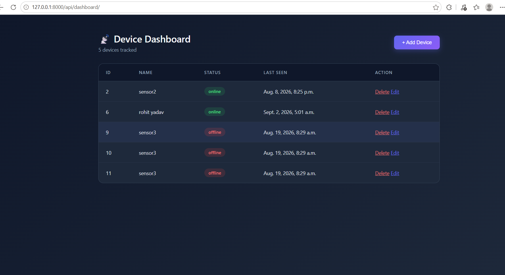
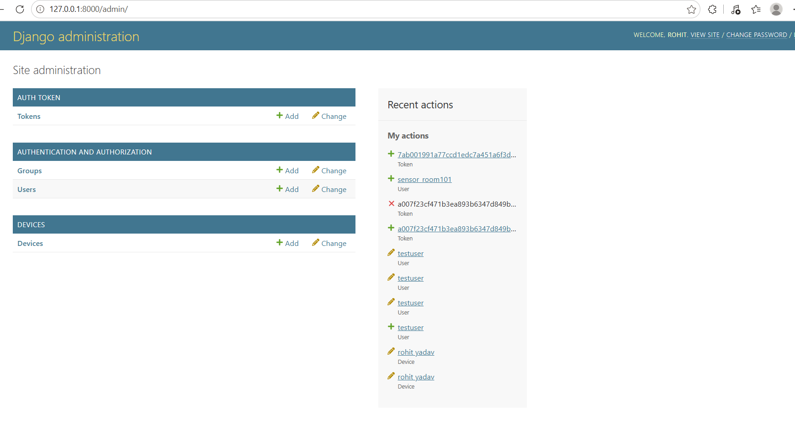
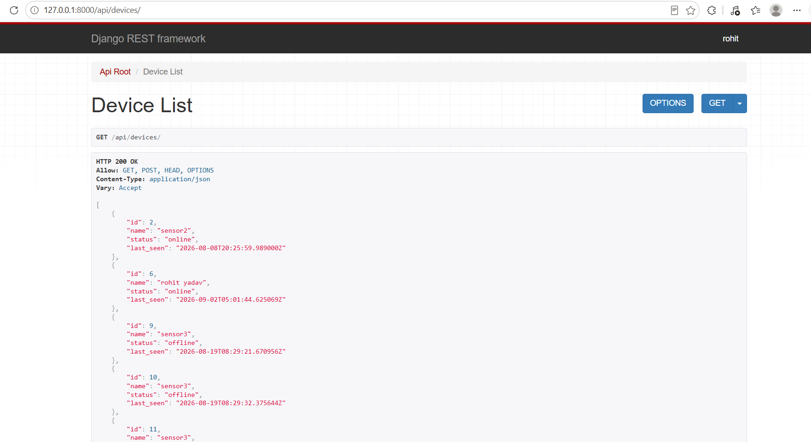
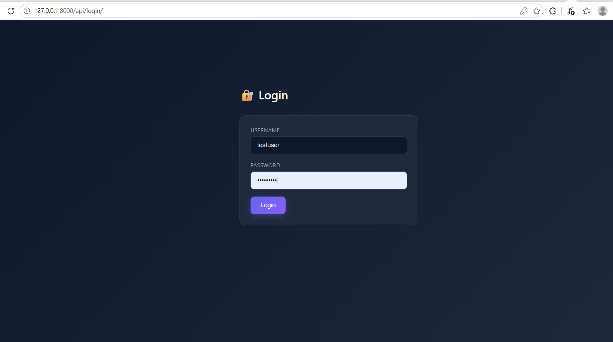

# 🛡️ SecureFleet — IoT Device Management REST API

A Django REST Framework-based backend system for managing an IoT device fleet, built with a focus on real-world backend engineering practices: authentication, authorization, rate-limiting, and full CRUD functionality.

---

## 📸 Screenshots

### Device Dashboard


### Admin Panel


### REST API Response


### Login Page


---

## 🚀 Features

- **Full CRUD** — Create, Read, Update, Delete devices via both a web dashboard and a REST API
- **Triple Authentication System**
  - Session-based auth for the browser dashboard
  - Token-based auth for programmatic/device-level API access
  - JWT (access + refresh tokens) for modern API authentication
- **Role-Based Access Control** — Staff-only Django admin access, separate login flow for regular users
- **API Rate Limiting (Throttling)** — Protects endpoints from abuse (5 requests/minute per user)
- **Custom-Styled Dashboard** — Responsive UI built with Django templates and vanilla CSS/JS
- **Tested End-to-End** — Verified using Postman and a Python client script simulating real device authentication

---

## 🛠️ Tech Stack

- **Backend:** Python, Django, Django REST Framework
- **Authentication:** Django Session Auth, DRF Token Auth, SimpleJWT
- **Database:** SQLite (via Django ORM)
- **Frontend:** HTML, CSS, JavaScript (Django Templates)
- **Testing:** Postman, Python `requests` library

---

## 📁 Project Structure

```
myproject/
├── devices/                 # Main application
│   ├── models.py            # Device model
│   ├── serializers.py       # DRF serializers
│   ├── views.py             # API + dashboard views
│   ├── urls.py               # App-level routing
│   └── templates/devices/    # Dashboard, login, edit HTML
├── myproject/                # Core settings & project-level URLs
├── manage.py
└── requirements.txt
```

---

## ⚙️ Setup & Installation

```bash
# Clone the repository
git clone https://github.com/rohitydv26122002-tech/SecureFleet-Django-API.git
cd SecureFleet-Django-API

# Create and activate a virtual environment
python -m venv .venv
.venv\Scripts\Activate.ps1      # Windows
source .venv/bin/activate       # macOS/Linux

# Install dependencies
pip install django djangorestframework djangorestframework-simplejwt

# Run migrations
python manage.py migrate

# Create an admin user
python manage.py createsuperuser

# Start the server
python manage.py runserver
```

Visit:
- Dashboard: `http://127.0.0.1:8000/api/dashboard/`
- Admin Panel: `http://127.0.0.1:8000/admin/`
- API: `http://127.0.0.1:8000/api/devices/`

---

## 🔑 API Authentication

### Get a Token
```bash
POST /api/token/
Body: { "username": "your_username", "password": "your_password" }
```

### Get a JWT
```bash
POST /api/jwt/token/
Body: { "username": "your_username", "password": "your_password" }
```

### Use the Token
```bash
GET /api/devices/
Header: Authorization: Token <your_token>
```
or for JWT:
```bash
Header: Authorization: Bearer <your_access_token>
```

---

## 📡 API Endpoints

| Method | Endpoint | Description | Auth Required |
|--------|----------|-------------|----------------|
| GET | `/api/devices/` | List all devices | ✅ |
| POST | `/api/devices/` | Create a new device | ✅ |
| GET | `/api/devices/{id}/` | Get a specific device | ✅ |
| PUT | `/api/devices/{id}/` | Update a device | ✅ |
| DELETE | `/api/devices/{id}/` | Delete a device | ✅ |
| POST | `/api/token/` | Obtain auth token | ❌ |
| POST | `/api/jwt/token/` | Obtain JWT pair | ❌ |
| POST | `/api/jwt/refresh/` | Refresh JWT access token | ❌ |

---

## 🎯 What This Project Demonstrates

This project was built to practice real-world backend engineering concepts relevant to IoT systems:
- Designing secure APIs for both human users and machine/device clients
- Implementing multiple authentication strategies appropriate to different client types
- Protecting APIs from abuse via rate-limiting
- Testing APIs the way a real device would authenticate and communicate — not just through a browser

---

## 👤 Author

**Rohit Yadav**
[LinkedIn](https://www.linkedin.com/in/rohit-yadav-23707639a) · [GitHub](https://github.com/rohitydv26122002-tech)
